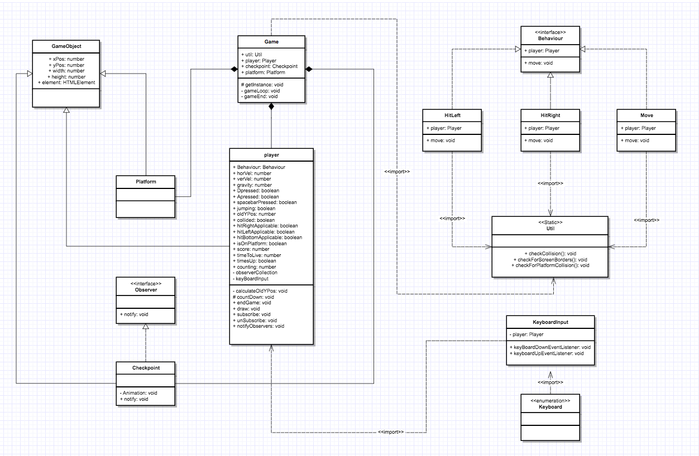

# Typescript game

Link to the game: `http://ivovanderknaap.nl/typescript/dist/`

### UML - diagram

### Installation

Clone this repository to your local machine. Then build the project by running: `npm install`. The project is build using webpack, to run the server you must run `npm run start`. This will run a local server on `http://localhost:9000`.

### Programming principles
#### Interface

As you can see in the ULM above the behaviour of the player is an interface. This interface has a couple of functions e.g. it can make the player move.

#### Static Utility Method

The game has a static utility method which has a function to check if two instances have collided.

#### Singleton

The game obejct itself is a singleton.

#### Strategy

The movement of the player is stated in a different class than the player class. This is made accoring to the strategy pattern.

#### Observer pattern

The checkpoints are all observers listening to the player. If the player's time to live gets below 3 seconds the all of the checkpoint's y positions move up to twice their height.

#### Abstract class

The gameobject which is the basic blueprint for all game objects is an abstract class.

#### Polymorphism

Through composition and inheritance is my game using polymorphism.

#### GameLoop

The game runs on a gameloop which is located in the game object.

#### Namespace

The keyboardInput class is located in a namespace 'keyHandlers'.

#### Enums

The keyboard uses a enumeration for easier keyCode bindings.

#### Encapsulation

Some properties in various classes have been protected so that they are being encapsulated from the rest of the game.

#### Composition

The game has a player and a checkpoint.

#### Inheritance

There is a base class called gameObject that has standard properties. The player and checkpoint class extend this class.

### Feedback Week 4

De Game krijgt van mij een voldoende. 
- Interface is aanwezige in behaviour met de bijbehorende functies. In dit geval Move die Behaviour implement. 
- De Util method is static gemaakt en controleert of twee objecten elkaar raken.
- De Game class is een singleton gemaakt. private static instance: Game; en daarna het gebruik van getInstance.
- In player wordt niet het lopen afgehandeld, dit wordt in Move gedaan waardoor code gescheiden blijft en er dus Strategy is.
- Er wordt gebruik gemaakt van public, private en protected functies.
- De player heeft een checkpoint en er dus composition.
- GameObject is aangemaakt en hieruit erft checkpoint en player. Er is dus extends functies en daardoor ook inheritance.
- Toevoeging: player en checkpoint removement toegevoegd.

### Feedback Week 7

Deze game krijgt van mij een voldoende. Hij voldoet aan alle eisen die zijn gesteld: 

- Interface zit in behaviour en natuurlijk in het 
- De Utlil method is een static die controleert of twee objecten elkaar raken. 
- De Game class is een singleton. Je kunt getInstance doen om een instantie aan te maken van de game of om een instantie terug te krijgen als deze al is aangemaakt.
- In player staat niet de code voor het lopen dit word afgehandeld in de player-states. Hierdoor is de code netjes gescheiden en is het Strategy pattern toegepast. 
- Er word gebruikt gemaakt van public, private en proctected functies en variabele dus encapsulation is correct toegepast. 
- Player, Platform en checkpoint erven van GameObject. Hierdoor is inheritance toegepast.
- Namespace is toegepast in de keyboardInput class
- Enumeraties zijn teogepast in het binden van de Keycodes.
- GameObject is een abstract class dit is de blueprint voor alle gameobjecten. Hier mag geen instance van gemaakt worden.
- Observer pattern is toegepast. De checkpoints zijn de observer en de player is de observable.
- Als library is er gebruik gemaakt van bounce.js deze zorgt voor de animatie van de checkpoints. Deze library is een animatie library en laat de checkpoints op en neer bewegen.

### Feedback Week 7 (2)

Alle eisen van week 4 en week 7 zijn verwerkt in je game, zoals je zelf hebt beschreven in je readme.
Ik kon je game gemakkelijk installeren en lokaal spelen.
Verder een originele game, goed gedaan! Uiteraard een voldoende :)

